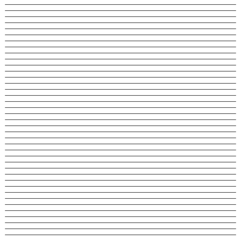
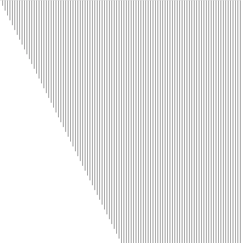
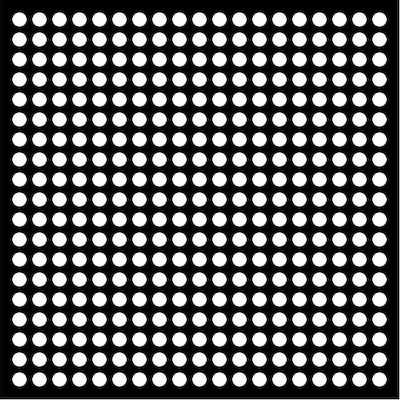

## Homework 5 (due Saturday, March 2, 2019, 11:59pm)

You will be submitting each homework assignment into a new GitHub repository each week. [Here are instructions on how to do so.](https://github.com/zamfi/github-guide/blob/master/README.md) Please email me if you have any questions.

### Classwork Wrap-up

In class, we started writing a clone of the classic game Pong.  Here's a link
to the program we ended up with: [pong.js](../sketches/pong.js)

**Assignment**: Make additional improvements to our Pong clone.  Some of the
improvements might include:

* Display the score on the screen, referencing the variables leftScore and rightScore.

* When a player currently scores, a messeage is displayed on the screen and
the game stops (by calling `noLoop()`).  Instead, increment the appropriate
player's score, and restart the puck in the center of the screen with a
random direction.

* Optional challenge:  When the puck hits the paddle in the original
Pong, the direction of the puck changes based on what part of the paddle the
puck hit.  For example, if the puck hit in the middle, it won't have much Y
velosity.  Or, if the puck hits the end of the paddle, it has a lot of Y
velosity.  Can you add similar functionality to our clone?

* Optional challenge:  Replace the left hand side player with a computer
opponent.   Rather than moving the left paddle based on user input, write
code to always move the paddle to intercept the puck.

...but you don't have to do all of them.  You could also add some other
imporvements not listed above.  Just be sure to add comments to the top of 
your program explaining what features you added to your version.

Uploaded your updated Pong program to your repo in a file named `pong.js`.

### Practice with Loops

Here's one way of working with loops, and figuring out how to turn a pattern into code:

1. Write down the coordinates of the shapes you want to create in your loop.

2. Find the pattern for those coordinates
  - a. Where does it start?
  - b. Where does it end?
  - c. How much does it change each time?

3. Use that pattern in a *for* loop: `for (var i = START; i < END; i = i + CHANGE) { ... }`

For example, to create the following sketch:


...start by writing down some endpoints for those lines:

```
(20, 20) -> (20, 20)
(20, 30) -> (30, 20)
(20, 40) -> (40, 20)
(20, 50) -> (50, 20)
(20, 60) -> (60, 20)
(20, 70) -> (70, 20)
(20, 80) -> (80, 20)
.
.
.
(20, 380) -> (380, 20)
```

...from these coordinates, we can find a pattern for each of the four parameters we need to draw a line:

- `startX`: always 20
- `startY`: starts at 20, ends at 380, goes up by 10 each time
- `endX`: starts at 20, ends at 380, goes up by 10 each time
- `endY`: always 20

...from this pattern, we can generate a loop that draws these lines, by creating a variable that starts at `20`, ends at `480`, and goes up by `10` each time. We won't call the variable `x` or `y` beacuse we don't use it exclusively for either coordinate.

```javascript
function setup() {
  createCanvas(400, 400);
}

function draw() {
  background(220);
  for (var i = 20; i <= 380; i = i + 10) {
    var startX = 20;
    var startY = i;
    var endX = i;
    var endY = 20;
    line(startX, startY, endX, endY);
  }
}
```

**Assignment**: Recreate the following images. Name them in your repository as labeled below.

You may find it help, before starting this exercise, to re-watch Daniel Shiffman's video tutorials about [`while` and `for` loops](https://www.youtube.com/watch?v=cnRD9o6odjk) and [nested loops](https://www.youtube.com/watch?v=1c1_TMdf8b8).

1.  `vertical-lines.js` -- first, some vertical lines:

    

    To get you started, let's apply the instructions above to this image of vertical lines. First, we note the endpoints of the first few lines:

    ```
    (10, 10) -> (10, 390)
    (20, 10) -> (20, 390)
    (30, 10) -> (30, 390)
    .
    .
    .
    (390, 10) -> (390, 390)
    ```

    So, we have `x1` and `x2` as the only values that change; they **start** at `10`, go **up to** `390`, and go **up by** `10` each time. That means we can use a `for` loop.

    ```javascript
    function setup() {
      createCanvas(400, 400);
    }

    function draw() {
      background(220);
      for (var i = 10; i <= 390; i = i + 10) {
        line(i, 10, i, 390);
      }
    }
    ```        

2.  `horizontal-lines.js` -- next, make horizontal lines:

    

3.  `concentric-circles.js` -- try these concentric circles too:

    

4.  `cone-of-lines.js` -- and this cone:

    

5.  `diamond-lines.js` -- also this diamond:

    

6.  `taller-lines.js` -- what about these taller lines?

    

7.  `circle-grid.js` -- now try this grid of circles; you'll need **nested loops** for this one (a loop within a loop):

    

8.  **Optional Challenge**: `art-deco.js` -- you'll need a nested loop for this one, too:

    
